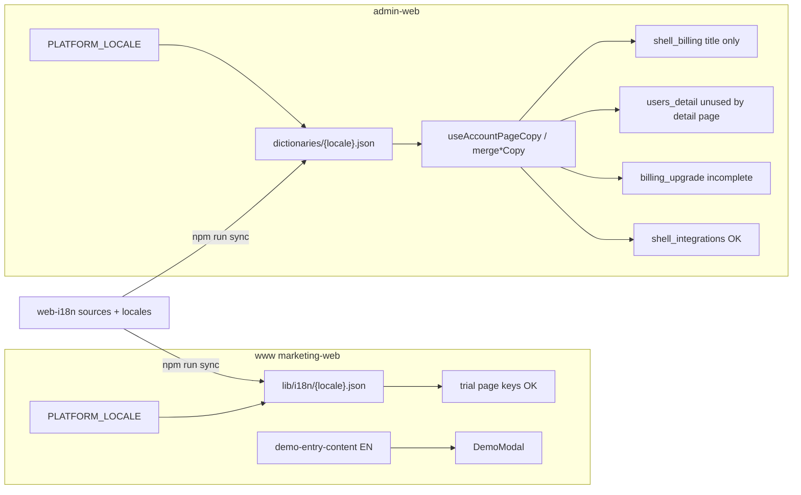

# Account·www Demo·Trial 다국어 지원 기획서

> **범위:** www Demo 경험 모달, www `/trial` QA, account Billing / Users detail / Integrations hub / Billing upgrade  
> **관련:** [PLAN-translation-account-www-app.md](./PLAN-translation-account-www-app.md) · [PLAN-www-home-faq-footer-i18n.md](./PLAN-www-home-faq-footer-i18n.md) · [PLAN-locale-persistence-cross-domain-ko.md](./PLAN-locale-persistence-cross-domain-ko.md)

**로케일:** `en` + 13비EN (`ko` `ja` `zh` `ar` `vi` `th` `id` `ms` `si` `ur` `hi` `ru` `my`) — [`manifest/locales.json`](../manifest/locales.json).  
**Glossary:** `Work App` / `Work Desk` / 브랜드명은 EN 유지 ([`manifest/glossary.json`](../manifest/glossary.json)).

---

## 1. 문제 요약

| Surface | URL | 현상 | 근본 원인 |
|---------|-----|------|-----------|
| www Demo 모달 | 홈 CTA → “Choose your Vouus experience” | 로케일 변경해도 EN | `demo-entry-content.ts` + `DemoModal.tsx` 하드코딩 — dictionary 키 없음 |
| www Trial | `/trial` | 일부 로케일에서 EN으로 보임 가능 | UI는 `useMarketingRouteI18n('trial')` **이미 배선됨**. 잔존 갭은 (a) locale 값이 EN placeholder, (b) 정적 export SEO title EN, (c) 게이트웨이/CP 에러 문구 |
| account Billing | `/billing` | 제목 외 본문 EN | `shell_billing` JSON에 title/subtitle만 있고 body 키 없음 → EN fallback |
| account Users detail | `/users/[email]?tenant_id=…` | 거의 EN (ko만 TS 하드코딩) | Detail 페이지가 `useUsersDetailCopy()`가 아니라 `usersDetailCopyForLocale()` (en/ko only) 사용 |
| account Integrations | `/integrations` | 허브 chrome은 양호 | catalog `displayName`/`description`·하위 slug/Xero 페이지는 별도 트랙 |
| account Upgrade | `/billing/upgrade` | 본문·피커·에러 EN | `billing_upgrade` 키 부족 + `UpgradePlanPicker` 하드코딩 |



---

## 2. 목표 및 성공 기준

1. Demo 모달·Billing 본문·Users detail·Upgrade UI가 선택 로케일에서 glossary 예외를 제외하고 현지어로 표시.
2. 기존 패턴 유지: www = `pickShellLabel` / `pickMarketingI18nString`; account = `merge*Copy` + `dictionaries/*.json`.
3. `web-i18n`: `npm run verify` → `npm run sync` 후 product CI (`verify:www`, admin-web `dictionaries:check`).
4. P0(`ko`/`ja`/`zh`)는 `translationStatus: reviewed` 목표; 나머지 로케일은 key parity + 1차 번역.
5. E2E/스모크: www locale-switch에 Demo 모달 断言; account는 ko에서 주요 라벨 스모크.

---

## 3. 아키텍처

| Surface | 배선 | Canonical EN | Sync 대상 |
|---------|------|--------------|-----------|
| www Demo | `useShellNavI18n` + `pickShellLabel` | `sources/en/www/shell.page.json` (`demo_modal_*`) | `web-public/.../lib/i18n/*.json` |
| www Trial | 이미 `trial` namespace | `sources/en/www/trial.page.json` | 동일 — 번역 QA + document title |
| account | `useShellBillingBodyCopy` / `useBillingUpgradeCopy` / `useUsersDetailCopy` | `sources/en/account/*.page.json` | `core-platform/apps/admin-web/dictionaries` |

**결정:** Demo 모달 키는 `www.shell`에 둔다 (`demo_modal_*`). 홈 전용이 아니라 여러 CTA에서 열리므로 shell이 맞다.

---

## 4. 키 스키마

### 4.1 www Demo 모달 (`www.shell`)

| Key | EN |
|-----|-----|
| `demo_modal_title` | `Choose your {brand} experience` |
| `demo_modal_close_aria` | `Close` |
| `demo_modal_options_aria` | `Demo options` |
| `demo_option_work_app_label` | `Work App` |
| `demo_option_work_app_subtext` | `Experience the daily employee workflow with a live demo account.` |
| `demo_option_work_desk_label` | `Work Desk` |
| `demo_option_work_desk_subtext` | `Explore administration, approvals, and business workflows.` |
| `demo_option_guided_label` | `15-min call` |
| `demo_option_guided_subtext` | `Meet remotely with a product specialist for live Q&A and workflow guidance.` |

### 4.2 www Trial

- 추가 배선 최소화. `trial.*` 키 parity·locale 값 감사.
- 클라이언트 document title in-scope; 정적 SEO meta는 out-of-scope.

### 4.3 account Billing (`shell_billing` / `account.shell.billing`)

`mergeShellBillingBodyCopy`의 `pick` 키 전부 (~40): `signInRequired`, `subscriptionTitle`, `upgradePackage`, `labelBillingCycle`, …

### 4.4 account Upgrade (`billing_upgrade`)

`signInRequired`, `workspaceUnknown`, `checkoutCanceled`, `currentPackage`, `billingCycle`, `nextBilling`, `syncing`, `opening`, `managePayment`, `currentPlan`, `monthly`, `yearlySave`, `contactSales`, `customPricing`, `processing`, `highestPlanBody`, …

### 4.5 account Users detail (`users_detail`)

Detail 페이지 → `useUsersDetailCopy()`; toast/dialog 키 추가; KO dictionary EN 잔존분 교체.

### 4.6 account Integrations

Hub: `shell_integrations` 번역 QA. Detail/Xero/catalog 설명은 out-of-scope.

---

## 5. 작업 페이즈

| Phase | 내용 | Repo |
|-------|------|------|
| **P0** | 본 기획서 + README 링크 | web-i18n |
| **P1** | Demo 모달 keys + DemoModal 배선 + 번역 + e2e | web-i18n → web-public |
| **P2** | Trial locale QA + document title | web-i18n → web-public |
| **P3** | Billing body 키·번역 | core-platform + web-i18n |
| **P4** | Upgrade keys + picker/page | core-platform + web-i18n |
| **P5** | Users detail hook 전환 + toast | core-platform + web-i18n |
| **P6** | Integrations hub QA + RTL | web-i18n |

**우선순위:** P1 → P3/P4/P5 → P2/P6.

---

## 6. 검증 체크리스트

- [x] `web-i18n`: 기획서 + patch scripts (`patch:www-demo-modal`, `patch:account-billing-upgrade`)
- [x] marketing-web: DemoModal shell i18n 배선 + locale-switch e2e 케이스
- [x] admin-web: `shell_billing` body keys, `billing_upgrade` picker/page, `UserDetailPage` → `useUsersDetailCopy`
- [x] Trial: `MarketingDocumentTitle` 이미 배선; SEA locale trial EN-identical = 0 (감사)
- [x] Integrations hub: KO 완료; AR/UR chrome 보강 (RTL)
- [ ] 수동: `my`/`ko`에서 홈 → Demo 모달, `/trial`, Billing / Users detail / Integrations / Upgrade
- [ ] CI: marketing-web `verify:i18n-bundles`, admin-web `dictionaries:check` / `test:dictionaries`

---

## 7. 명시적 제외

- Control Plane `/cp/*`
- 법률 docs / transactional email
- pricing-catalog 플랜명·호스팅 모델 공유 패키지 i18n
- Integrations detail/Xero 하위 페이지
- Trial 정적 export SEO meta (클라이언트 title은 포함)

---

## 8. 구현 상태 (2026-07-19)

| Phase | 상태 | 비고 |
|-------|------|------|
| P0 기획서 | 완료 | 본 문서 + README 링크 |
| P1 Demo 모달 | 완료 | `demo_modal_*` + `DemoModal` + e2e |
| P2 Trial QA | 완료 | SEA EN-identical 0; `MarketingDocumentTitle` 기존 배선 |
| P3 Billing body | 완료 | `shell_billing` ~50키 + KO/JA/ZH |
| P4 Upgrade | 완료 | `billing_upgrade` 확장 + picker/page |
| P5 Users detail | 완료 | `useUsersDetailCopy` + toast/dialog + KO overlay |
| P6 Integrations | 완료 | KO hub OK; AR/UR chrome 보강 |

```bash
# web-i18n
npm run patch:www-demo-modal
npm run patch:account-billing-upgrade

# admin-web
pnpm run dictionaries:sync && pnpm run dictionaries:check
```
