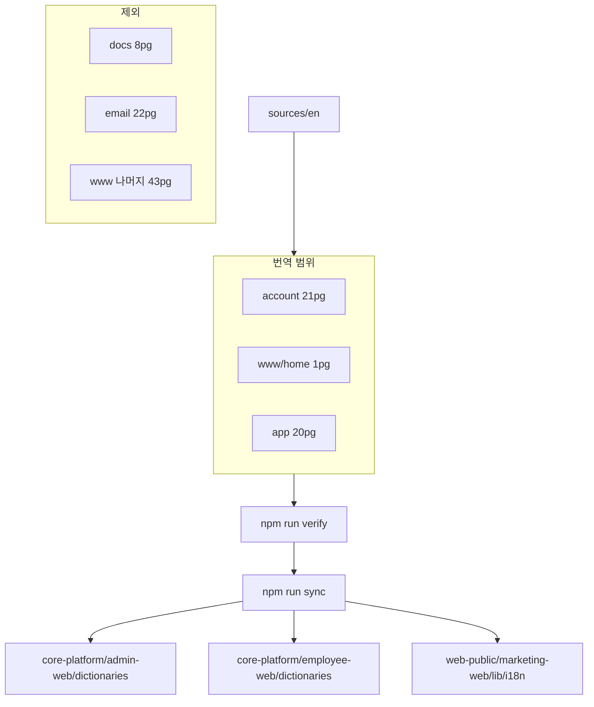

# account / www 메인 / app 다국어 번역 기획서

> **범위:** `docs`·`email`·`www` 나머지 페이지 제외. **account.vouus.com**, **www.vouus.com** 메인(`/`) 1페이지, **app.vouus.com** 전체를 **11개 비영문 로케일**로 번역한다.

플랫폼 개요: [PLAN-ko.md](./PLAN-ko.md) · English: [PLAN-en.md](./PLAN-en.md)

---

## 1. 범위 정의

### 1.1 포함

| Surface | 도메인 | web-i18n 경로 | 페이지 수 | EN 규모 |
|---------|--------|---------------|-----------|---------|
| **account** | account.vouus.com | `locales/{locale}/account/*.page.json` | **21** | 318키 / 11,034자 |
| **www (메인만)** | www.vouus.com `/` | `locales/{locale}/www/home.page.json` | **1** | 74키 / 3,011자 |
| **app** | app.vouus.com | `locales/{locale}/app/*.page.json` | **20** | 1,300키 / 25,250자 |

**로케일 (11):** `ja`, `ko`, `zh`, `ar`, `vi`, `th`, `id`, `ms`, `si`, `ur`, `hi` — [`manifest/locales.json`](../manifest/locales.json)  
**RTL:** `ar`, `ur`

**총 작업 단위:** 42페이지 × 11로케일 = **462 page-locale 파일**. 파일·키 구조는 EN과 parity가 이미 맞춰져 있으며, **값(번역 문자열) 교체**가 과제이다.

### 1.2 명시적 제외

| 제외 대상 | 이유 |
|-----------|------|
| `docs/*` (8건) | 법률 MDX — 법무 검수·대용량 본문 별도 트랙 |
| `email/*` (22건) | 트랜잭션 메일 — 별도 기획 |
| `www/*` home 외 (43건) | pricing, solutions, blog, legal www 등 |
| Control Plane `/cp/*` | 운영 UI — 번역 비대상 |

### 1.3 아키텍처



---

## 2. 현황 및 갭 분석

실측 기준(2026-07): EN `sources/en`과 `locales/{locale}` 값을 비교한 **미번역(EN 동일) 문자 합계 약 313,924 locale-char**.

| Surface | 총 미번역량 | P0 (`ja`/`ko`/`zh`/`ar`/`vi`) | SEA (`th`/`id`/`ms`/`si`/`ur`/`hi`) |
|---------|-------------|--------------------------------|-------------------------------------|
| **home** | 24,121 | `ko`/`ja`/`zh` **reviewed** (~11자 잔존) | 8로케일 × 3,011자 **100% EN** |
| **account** | 106,298 | 5로케일 × ~10,983자 **99% EN** | 6로케일 × ~8,530~8,596자 **75~78% EN** |
| **app** | 183,505 | 5로케일 × ~5,645~6,850자 **21~25% EN** | 6로케일 × 25,202자 **100% EN** |

### 핵심 인사이트

1. **account** — `ko` 포함 P0 전 로케일이 사실상 **영문 UI**. 가입·온보딩·빌링 퍼널에 직접 영향 → **최우선**.
2. **app** — P0는 `employee-web` import로 **약 75~80% 완료**. SEA 6로케일은 **전면 번역** 필요.
3. **home** — `ko`/`ja`/`zh`는 reviewed 완료. **`ar` + SEA 7로케일**만 본격 작업.
4. **myAi** (`app/myAi.page.json`) — 541키 / 9,753자로 app EN의 **39%**. 단독·청크 세션 권장.

---

## 3. 목표 및 성공 기준

| # | 기준 |
|---|------|
| 1 | 42페이지 × 11로케일에서 EN placeholder 제거 (glossary 예외 제외) |
| 2 | `npm run verify` 통과 — key parity, secret scan, keyword index |
| 3 | P0 로케일 `meta.translationStatus: "reviewed"` 시 EN 동일 비율 **≤ 85%** ([`scripts/validate.mjs`](../scripts/validate.mjs) `P0_LOCALES`: ko, ja, zh) |
| 4 | `npm run sync` 후 product repo CI 통과 — admin-web dictionaries, employee-web `dictionaries:check`, marketing-web `lib/i18n` |
| 5 | CP `/cp/i18n` coverage에서 해당 surface·로케일 gap 없음 |

---

## 4. 번역 가이드라인

[`manifest/glossary.json`](../manifest/glossary.json) 준수.

### 4.1 번역하지 않음

- 브랜드: `Vouus`, `Pregoi`, `ERPNext`, `Frappe`, `Odoo`, `Xero`, `Gokiri`
- productTerms: `Work App`, `Work Desk` (ko/ja 명시 EN 유지)
- 제품 기능명: `Autopilot`, `Knowledge` — 협의 전까지 EN 유지 가능 (app `myAi`)

### 4.2 반드시 보존

- Placeholder: `{n}`, `{brand}`, `{companyId}`, `{locale}`, `{label}`, `{title}` 등
- HTML/MDX 태그, JSX 주석 블록
- 숫자·통계 literal (`80%`, `3×`, `Day 1`) — 문맥상 번역 가능하나 키별 일관성 유지

### 4.3 톤·스타일

| Surface | 톤 |
|---------|-----|
| account | 존댓말, 명확한 CTA, 오류·법적 문구는 직설적 |
| app | 짧은 라벨·버튼, 모바일 한 줄 overflow 주의 |
| home | B2B 마케팅, ko reviewed 톤을 SEA/ar 레퍼런스로 |

### 4.4 Surface별 키 규칙

| Surface | 키 스타일 | sync namespace 예 |
|---------|-----------|---------------------|
| account | dot 파일명 → flat/snake | `auth.signin.page.json` → `auth_signin` |
| app | nested camelCase | `myAi`, `signin`, `common` |
| home | snake_case flat | `hero_title`, `pillars_0_title` |

### 4.5 RTL (`ar`, `ur`)

문자열만 번역. 레이아웃 RTL·미러링은 product repo Phase 2 (locale cookie / dir attribute).

---

## 5. 실행 로드맵

### Phase A — account 퍼널 (1~2주, 최우선)

**방식:** 로케일당 **1 Agent 배치** — 해당 로케일 `account/*.page.json` 21파일 일괄.

**페이지 우선순위**

1. `auth.signin`, `auth.signup`, `auth.verify`
2. `onboarding.*` (7건)
3. `billing.upgrade`, `billing.upgrade_success`
4. `shell.common`, `shell.dashboard`
5. 나머지 `shell.*`, `integrations.xero_migration`

**로케일 순:** `ko` → `ja` → `zh` → `vi` → `ar` → `th` → `id` → `ms` → `si` → `ur` → `hi`

### Phase B — app P0 정리 (1주)

대상: `ja`, `ko`, `zh`, `ar`, `vi` — EN 잔존 **~5,645~6,850자/로케일**.

| 우선 | 페이지 |
|------|--------|
| 높음 | `menu`, `common`, `signin`, `signup`, `passcode`, `onboarding` |
| 대형 | `myAi` — nav / wizard / landing / templates 3~4 청크 |
| 중형 | `invoices`, `moduleGuide`, `profile`, `expenses`, `leaves` |
| 소형 일괄 | `calendar`, `notFound`, `customers`, `notices`, `checkin`, `checklist`, `auth`, `locationPermission` |

### Phase C — app SEA 6로케일 전면 (2~3주)

대상: `th`, `id`, `ms`, `si`, `ur`, `hi` × 20페이지 (**로케일당 1배치**, ~25,202자/로케일).

1. `npm run batch:seed-missing` 로 EN 초안 + 최소 override
2. Cursor AI로 locale별 정제
3. `myAi`는 로케일·페이지 단독 세션

### Phase D — www home (3~5일)

| 로케일 | 작업 |
|--------|------|
| `ko`, `ja`, `zh` | EN 동일 4키만 수정, `reviewed` 유지 |
| `ar`, `vi`, `th`, `id`, `ms`, `si`, `ur`, `hi` | `home.page.json` 전체 번역 (~3,011자) |

`ko` reviewed 카피를 SEA/`ar` 톤 레퍼런스로 사용.

### Phase E — 검수·sync·배포 (1주)

1. `npm run verify`
2. `npm run sync` → core-platform / web-public PR merge
3. CP `POST /internal/v1/i18n/sync-github` 또는 CI sync-cp-manifest 확인
4. 샘플 QA: account `/sign-in`, app 메뉴·로그인, www `/`

---

## 6. 작업 워크플로

```bash
# EN drift 확인 (product repo 변경 후)
npm run extract

# 번역: locales/{locale}/{surface}/*.page.json 편집

# 검증
npm run verify

# product repo 반영
npm run sync
```

### Cursor AI 프롬프트 (페이지·로케일 배치)

```
Translate values in locales/{locale}/account/*.page.json (or app/, www/home.page.json)
from sources/en counterparts to {locale}. Keep all keys identical.
Preserve placeholders like {n}, {companyId}, {locale} and HTML tags.
Do not translate terms in manifest/glossary.json (Vouus, Pregoi, Work App, Work Desk, …).
Output valid JSON; set meta.method to "cursor-ai" and meta.translationStatus to "ai_draft".
For ko/ja/zh after human review, set translationStatus to "reviewed".
```

### 메타데이터

| 필드 | 값 |
|------|-----|
| `meta.method` | `cursor-ai` · `cursor-ai-2` · `import-employee-web` |
| `meta.translationStatus` | `ai_draft` → (검수 후) `reviewed` |
| `versions/{pageId}.json` | locale, method, enHash, at append |

### 효율 원칙

- **로케일 × surface 배치** 번역 (462 page-locale 개별 세션 금지)
- account: **11세션** (로케일당 1회)
- app SEA: **6세션** + P0 정리 **5세션**
- home: **1~2세션** (P0 잔존 + SEA/ar 일괄)

---

## 7. sync 대상

[`scripts/sync-to-apps.mjs`](../scripts/sync-to-apps.mjs):

| Surface | Product repo 경로 |
|---------|-------------------|
| account | `core-platform/apps/admin-web/dictionaries/{locale}.json` |
| app | `core-platform/apps/employee-web/dictionaries/{locale}.json` |
| www (home) | `web-public/apps/marketing-web/lib/i18n/{locale}.json` |

**CI:** [`.github/workflows/sync-product-repos.yml`](../.github/workflows/sync-product-repos.yml) — `main` push 시 sibling PR  
**CP:** [infra-control-plane/docs/runbook/i18n-management.md](https://github.com/erp-labs/infra-control-plane/blob/main/docs/runbook/i18n-management.md)

---

## 8. 역할 및 검수

| 역할 | 책임 |
|------|------|
| 번역 실행 | Cursor AI + JSON 편집, glossary 준수 |
| ko/ja/zh 리뷰어 | account·home 카피 톤, CTA 검수 |
| QA | 퍼널 실기 (sign-in, onboarding, app menu, www `/`) |
| 엔지니어 | extract/sync PR, CI, CP coverage |

### 페이지 검수 체크리스트

- [ ] EN과 key set 100% 일치 (`npm run verify`)
- [ ] `{placeholder}`·HTML 무손실
- [ ] glossary 위반 없음
- [ ] EN 잔존 grep (`Sign in`, `Saving…`, `Continue` 등)
- [ ] P0 `reviewed` 시 EN 동일 비율 ≤ 85%
- [ ] RTL 로케일(ar, ur) 샘플 UI 확인 (Phase 2 전 문자열 길이)

---

## 9. 예상 토큰 및 비용

| 항목 | 미번역량 | Agent 토큰 (배치) | Auto 모드 | Pro $20/월 |
|------|----------|-------------------|-----------|------------|
| account × 11 | ~106k char | ~45~60만 | ~$0.5~2 | 포함 |
| app × 11 | ~184k char | ~55~75만 | ~$0.6~2.5 | 포함 |
| home × 11 | ~24k char | ~4~6만 | ~$0.05~0.15 | 포함 |
| **합계** | **~314k char** | **~110~140만** | **~$1.2~5** | **한 달로 충분** |

- **비효율** (462 page-locale 개별 Agent): **200만+ 토큰**, **$10~25** — 금지
- **Auto 모드** 권장: Pro 구독 포함 usage로 대부분 커버
- **Frontier 수동** (Sonnet 등): 합계 **$2~8** 수준

---

## 10. 부록

### A. account 페이지 (21건)

| 파일 | pageId | 키 | EN자 |
|------|--------|-----|------|
| `auth.signin.page.json` | `account.auth.signin` | 17 | 495 |
| `auth.signup.page.json` | `account.auth.signup` | 8 | 244 |
| `auth.verify.page.json` | `account.auth.verify` | 7 | 226 |
| `billing.upgrade.page.json` | `account.billing.upgrade` | 5 | 155 |
| `billing.upgrade_success.page.json` | `account.billing.upgrade_success` | 5 | 199 |
| `integrations.xero_migration.page.json` | `account.integrations.xero_migration` | 26 | 490 |
| `onboarding.company.page.json` | `account.onboarding.company` | 27 | 703 |
| `onboarding.dashboard.page.json` | `account.onboarding.dashboard` | 17 | 308 |
| `onboarding.launch.page.json` | `account.onboarding.launch` | 34 | 1,906 |
| `onboarding.payment_success.page.json` | `account.onboarding.payment_success` | 18 | 681 |
| `onboarding.platform.page.json` | `account.onboarding.platform` | 12 | 390 |
| `onboarding.provision_email.page.json` | `account.onboarding.provision_email` | 19 | 633 |
| `onboarding.review.page.json` | `account.onboarding.review` | 13 | 242 |
| `shell.backup.page.json` | `account.shell.backup` | 79 | 3,306 |
| `shell.billing.page.json` | `account.shell.billing` | 3 | 126 |
| `shell.common.page.json` | `account.shell.common` | 13 | 401 |
| `shell.dashboard.page.json` | `account.shell.dashboard` | 3 | 109 |
| `shell.integrations.page.json` | `account.shell.integrations` | 3 | 81 |
| `shell.profile.page.json` | `account.shell.profile` | 2 | 45 |
| `shell.usage.page.json` | `account.shell.usage` | 2 | 96 |
| `shell.users.page.json` | `account.shell.users` | 5 | 198 |

### B. app 페이지 (20건)

| 파일 | pageId | 키 | EN자 | 비고 |
|------|--------|-----|------|------|
| `auth.page.json` | `app.auth` | 24 | 756 | |
| `calendar.page.json` | `app.calendar` | 20 | 108 | 소형 |
| `checkin.page.json` | `app.checkin` | 24 | 367 | |
| `checklist.page.json` | `app.checklist` | 40 | 426 | |
| `common.page.json` | `app.common` | 41 | 531 | 공통 UI |
| `customers.page.json` | `app.customers` | 13 | 185 | |
| `expenses.page.json` | `app.expenses` | 64 | 998 | |
| `invoices.page.json` | `app.invoices` | 96 | 1,728 | 중형 |
| `leaves.page.json` | `app.leaves` | 38 | 687 | |
| `locationPermission.page.json` | `app.locationPermission` | 4 | 211 | |
| `menu.page.json` | `app.menu` | 16 | 127 | **메뉴 라벨** |
| `moduleGuide.page.json` | `app.moduleGuide` | 61 | 2,256 | 중형 |
| `myAi.page.json` | `app.myAi` | 541 | 9,753 | **최대** |
| `notFound.page.json` | `app.notFound` | 3 | 53 | |
| `notices.page.json` | `app.notices` | 14 | 225 | |
| `onboarding.page.json` | `app.onboarding` | 159 | 3,881 | 대형 |
| `passcode.page.json` | `app.passcode` | 28 | 949 | |
| `profile.page.json` | `app.profile` | 68 | 1,196 | |
| `signin.page.json` | `app.signin` | 30 | 558 | |
| `signup.page.json` | `app.signup` | 16 | 255 | |

### C. home (1건)

| 파일 | pageId | 키 | EN자 |
|------|--------|-----|------|
| `home.page.json` | `www.home` | 74 | 3,011 |

### D. 로케일별 미번역량 (EN 동일 문자 수)

**account (합계 106,298)**

| 로케일 | 미번역 char | EN 동일 % |
|--------|-------------|-----------|
| ja | 10,983 | 99% |
| ko | 10,983 | 99% |
| zh | 10,983 | 99% |
| ar | 10,983 | 99% |
| vi | 10,983 | 99% |
| th | 8,532 | 75% |
| id | 8,551 | 76% |
| ms | 8,540 | 76% |
| si | 8,596 | 78% |
| ur | 8,590 | 77% |
| hi | 8,574 | 77% |

**app (합계 183,505)**

| 로케일 | 미번역 char | EN 동일 % |
|--------|-------------|-----------|
| ja | 6,520 | 23% |
| ko | 5,645 | 21% |
| zh | 6,687 | 24% |
| ar | 6,591 | 23% |
| vi | 6,850 | 25% |
| th | 25,202 | 100% |
| id | 25,202 | 100% |
| ms | 25,202 | 100% |
| si | 25,202 | 100% |
| ur | 25,202 | 100% |
| hi | 25,202 | 100% |

**home (합계 24,121)**

| 로케일 | 미번역 char | EN 동일 % | meta |
|--------|-------------|-----------|------|
| ja | 11 | 5% | reviewed |
| ko | 11 | 5% | reviewed |
| zh | 11 | 5% | reviewed |
| ar | 3,011 | 100% | ai_draft |
| vi | 3,011 | 100% | ai_draft |
| th | 3,011 | 100% | ai_draft |
| id | 3,011 | 100% | ai_draft |
| ms | 3,011 | 100% | ai_draft |
| si | 3,011 | 100% | ai_draft |
| ur | 3,011 | 100% | ai_draft |
| hi | 3,011 | 100% | ai_draft |

### E. Phase별 완료 체크 (surface × 로케일)

| Phase | surface | 로케일 | page-locale 수 |
|-------|---------|--------|----------------|
| A | account | 11 | 231 |
| B | app | ja, ko, zh, ar, vi | 100 |
| C | app | th, id, ms, si, ur, hi | 120 |
| D | www | 11 | 11 |
| **합계** | | | **462** |

CP에서 진행률 확인: `GET /internal/v1/i18n/pages?surface=account&locale=ko` (Bearer `INTERNAL_API_KEY`)

### F. 관련 문서

- [PLAN-ko.md](./PLAN-ko.md) — 플랫폼 i18n 개요
- [PLAN-en.md](./PLAN-en.md) — English platform plan
- [README.md](../README.md) — extract / verify / sync 명령
- infra-control-plane `docs/runbook/i18n-management.md` — CP `/cp/i18n`

---

## Phase F — ru · my 신규 로케일 (2026-07)

**로케일:** `ru` (Русский, LTR), `my` (မြန်မာ, LTR) — 말레이어 `ms`와 별개.

| 단계 | 작업 |
|------|------|
| F1 | `manifest/locales.json` + `@platform/contracts` + picker/loaders |
| F2 | `npm run batch:seed-missing` → EN 초안 |
| F3 | `npm run locale:generate -- ru my` → `npm run locale:build -- ru my` |
| F4 | `meta.translationStatus: ai_draft` → (검수 후) `reviewed` |

**작업 단위:** 42 page × 2 locale = **84 page-locale** (총 630 page-locale when combined with 13 existing non-EN locales).

---

## Phase G — 크로스 도메인 언어 지속 (www ↔ account ↔ app)

**메커니즘:** `@platform/cookies` **`PLATFORM_LOCALE`** 쿠키 (`Domain=.vouus.com`) + **`platform:locale-changed`** 이벤트.

| Surface | 조치 |
|---------|------|
| **www** | `NEXT_PUBLIC_PRIMARY_DOMAIN=vouus.com` (Pages 빌드 env) |
| **account** | `PRIMARY_DOMAIN` in wrangler + **`PLATFORM_LOCALE_EARLY_SCRIPT`** in root layout |
| **app** | `NEXT_PUBLIC_PRIMARY_DOMAIN` at OpenNext build; middleware `getDefaultLocale()`; `EMPLOYEE_UI_LOCALE_CODES` matcher |

**QA (배포 전):** www에서 locale 선택 → account `/sign-in` → app `/{tenant}/{lang}/...` 동일 locale 유지.

---

## 11. 후속 과제 (본 기획 범위 외)

- `docs/*` 법률 8건 — 법무 승인 후 `published`
- `email/*`, `www/*` 나머지 43페이지
- `scripts/translation-packs/ko.json` 및 SEA 2차 패치 자동화
- end-user locale picker (Phase 2, `@platform/web-cookies`)
