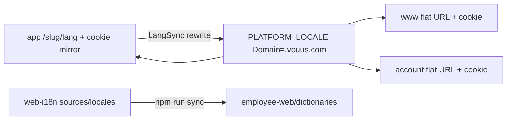

# Work App 전면 다국어 지원 기획서 (www 패리티)

> **대상:** `https://app.vouus.com/{companyId}/{lang}/…` (employee-web Worker)  
> **예시 테넌트:** `starhub` → `https://app.vouus.com/starhub`  
> **목표:** [www.vouus.com](https://www.vouus.com)과 동일한 **14개 로케일**을 Work App 전 페이지에서 설정·유지  
> **상태:** 구현 반영 (2026-07-19) — middleware 14로케일, 번역 커버리지 ~96–98%, RTL `ur` 정렬, web-i18n import  
> **관련:** [PLAN-translation-account-www-app.md](./PLAN-translation-account-www-app.md) (app Phase B/C 대체·확장) · [PLAN-locale-persistence-cross-domain-ko.md](./PLAN-locale-persistence-cross-domain-ko.md)

플랫폼 개요: [PLAN-ko.md](./PLAN-ko.md) · English: [PLAN-en.md](./PLAN-en.md)

---

## 1. 배경

- `starhub`는 **테넌트 슬러그**이며 Next 라우트 폴더가 아니다.
- 앱: sibling `core-platform/apps/employee-web` (레거시명 client-web).
- URL: `/{companyId}/{lang}/…` (예: `/starhub/ko/signin`).
- 체감 문제: 언어 변경 후에도 UI가 영어로 남거나, www에서 고를 수 있는 SEA/`ru`/`my` 등이 앱에서 깨지거나 미반영됨.

---

## 2. 목표 (www 패리티)

| code | label |
|------|--------|
| en | English |
| ko | 한국어 |
| ja | 日本語 |
| zh | 中文 |
| ar | العربية (RTL) |
| vi | Tiếng Việt |
| th | ไทย |
| id | Bahasa Indonesia |
| ms | Bahasa Melayu |
| si | සිංහල |
| ur | اردو (RTL) |
| hi | हिन्दी |
| ru | Русский |
| my | မြန်မာ |

SSOT: [`manifest/locales.json`](../manifest/locales.json), `@platform/contracts` `PLATFORM_UI_LOCALE_CODES` / `EMPLOYEE_UI_LOCALE_CODES`.

### 성공 기준

1. 로그인·프로필에서 14개 언어 선택 가능하고, 선택 직후·새로고침·메뉴 이동 후에도 UI가 해당 언어 유지.
2. www에서 `PLATFORM_LOCALE=ko` 설정 후 app 진입 시 `/{slug}/ko/…`로 정렬 (크로스 도메인).
3. `npm run verify`(이 레포) + `pnpm --filter employee-web run verify` + SEA/RTL E2E 통과.
4. glossary 예외를 제외하고 EN placeholder 잔존이 목표 임계 이하 (P0: EN 동일 비율 ≤ 85%).

---

## 3. 아키텍처 (라우팅 유지 · 쿠키 SSOT 공유)

www/account와 **라우팅 모델은 다르고**, **쿠키 SSOT는 동일**하다. app을 cookie-only로 바꾸지 않는다.



| Surface | URL | UI 카피 |
|---------|-----|---------|
| www | flat (`/`, `/pricing`) | cookie → `lib/i18n/{locale}.json` overlay |
| account | flat | cookie → `dictionaries/{locale}.json` |
| **app** | `/{slug}/{lang}/…` | URL `[lang]` + cookie 미러 → `dictionaries/{locale}.json` |

---

## 4. 현황 및 갭

### 이미 있는 것

- 14개 `dictionaries/{locale}.json` (~1,800+ leaf keys).
- 서버 `getDictionary` + `DictionaryProvider`, auth/프로필 언어 피커, `LangSync`, early script.
- `sources/en/app/*.page.json` 페이지 네임스페이스.
- Dashboard·Mailing 14로케일 overlay 완료 (employee-web `docs/planning/app-dashboard-mailing-i18n-plan.md`).
- P0(`ko`/`ja`/`zh`/`ar`/`vi`) app 번역 상당 부분 완료 (잔존 정리 필요).

### 갭

| # | 갭 | 조치 |
|---|-----|------|
| G1 | middleware `SUPPORTED_LOCALES`가 6개만 | `EMPLOYEE_UI_LOCALE_CODES`(14)로 통일 |
| G2 | `generateStaticParams` 6로케일 하드코딩 | 동일 SSOT |
| G3 | SEA + `ru`/`my` EN placeholder | Phase 3 번역 |
| G4 | P0 `myAi` 등 EN 잔존 | Phase 2 |
| G5 | UI 하드코딩 EN fallback | Phase 1 audit |
| G6 | Next 라우트 vs web-i18n 네임스페이스 불일치 | extract + manifest 등록 |
| G7 | RTL(`ar`/`ur`) 레이아웃 품질 | Phase 4 |

---

## 5. 범위

### 포함

- employee-web 인증·온보딩·앱 셸·전 기능 페이지.
- 14로케일 피커·쿠키·URL sync·locale CSS.
- web-i18n → sync → dictionaries → deploy.

### 제외

- Control Plane `/cp/*`, docs MDX, transactional email.
- ERP Desk UI 본체 (Work App 셸·BFF 카피만).
- www/account 카피 작업 (크로스 cookie만 검증).

---

## 6. 실행 로드맵

### Phase 0 — 로케일 인프라 정렬 (엔지니어링)

1. `employee-web/middleware.ts` → `EMPLOYEE_UI_LOCALE_CODES`.
2. `generateStaticParams` / demo layout allowlist 통일.
3. `dictionaries:check` · picker 스모크.
4. E2E: `locale-nav-sea-ru` + `/{slug}/th/...` rewrite 없음.

### Phase 1 — 키 커버리지

1. `npm run extract` (employee-web → `sources/en/app`).
2. 하드코딩 EN audit → dict 키 보강.
3. 누락 네임스페이스(`payroll` 등)를 `sources/en/app` + `manifest/pages.json`에 등록.
4. `pnpm --filter employee-web run dictionaries:sync` + `dictionaries:check`.

### Phase 2 — P0 번역 마감

대상: `ko`, `ja`, `zh`, `ar`, `vi`.

우선: `menu` → `common` → auth 퍼널 → `myAi` → ERP 모듈 → 잔여.

### Phase 3 — SEA + ru/my 전면

대상: `th`, `id`, `ms`, `si`, `ur`, `hi`, `ru`, `my` (로케일당 배치).

`npm run batch:seed-missing` → AI/스크립트 정제 → `npm run sync`.

### Phase 4 — RTL·UX·크로스 도메인

1. `ar`/`ur`: `dir=rtl`, overflow, 아이콘, 날짜 포맷.
2. www → app → www locale QA (Q3–Q5).
3. 프로필·auth 피커 14옵션 확인.

### Phase 5 — 검수·배포

| 검증 | 명령 |
|------|------|
| web-i18n | `npm run verify` |
| sync | `npm run sync` → core-platform PR |
| employee-web | `pnpm --filter employee-web run verify` |
| E2E | locale-* specs |
| 수동 | `app.vouus.com/starhub` 14로케일 × 핵심 퍼널 |

---

## 7. 번역 가이드

- [`manifest/glossary.json`](../manifest/glossary.json): `Vouus`, `Work App`, `Work Desk`, ERP 브랜드명 등 미번역.
- Placeholder `{n}`, `{companyId}`, `{locale}` 보존.
- 톤: 짧은 라벨·모바일 한 줄.
- 메타: `ai_draft` → 검수 후 `reviewed` (P0).

### 워크플로

```bash
npm run extract
# locales/{locale}/app/*.page.json 편집
npm run verify
npm run sync
```

---

## 8. 역할

| 역할 | 책임 |
|------|------|
| 엔지니어 | Phase 0–1, sync PR, middleware/E2E |
| 번역 실행 | Phase 2–3 |
| 리뷰어 | ko/ja/zh CTA·톤 |
| QA | starhub 실테넌트 + RTL |

---

## 9. 기존 문서와의 관계

| 문서 | 관계 |
|------|------|
| [PLAN-translation-account-www-app.md](./PLAN-translation-account-www-app.md) | account/www home 포함 — **app Phase B/C를 본 기획이 대체·확장** (14로케일) |
| [PLAN-locale-persistence-cross-domain-ko.md](./PLAN-locale-persistence-cross-domain-ko.md) | 쿠키·LangSync — Phase 4 재검증 |
| employee-web `app-dashboard-mailing-i18n-plan.md` | 완료 모듈 — regression만 |

---

## 10. 핵심 경로

| 역할 | 경로 |
|------|------|
| middleware | `core-platform/apps/employee-web/middleware.ts` |
| dictionary loader | `core-platform/apps/employee-web/lib/get-dictionary.ts` |
| LangSync | `core-platform/apps/employee-web/components/lang-sync.tsx` |
| EN sources | `web-i18n/sources/en/app/` |
| locales | `web-i18n/locales/{locale}/app/` |
| sync | `web-i18n/scripts/sync-to-apps.mjs` |
| locale codes | `core-platform/packages/contracts/src/platform-ui-locales.ts` |
